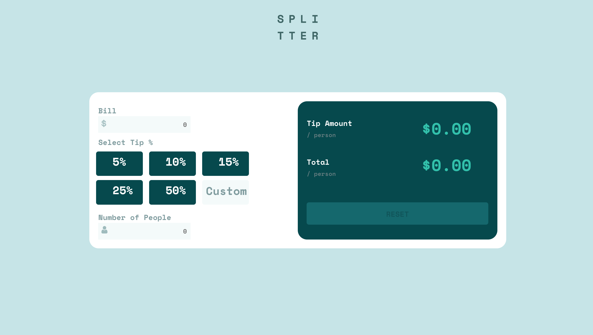

# Frontend Mentor - Tip calculator app solution

This is a solution to the [Tip calculator app challenge on Frontend Mentor](https://www.frontendmentor.io/challenges/tip-calculator-app-ugJNGbJUX). Frontend Mentor challenges help you improve your coding skills by building realistic projects.

## Table of contents

- [Overview](#overview)
  - [The challenge](#the-challenge)
  - [Screenshot](#screenshot)
  - [Links](#links)
- [My process](#my-process)
  - [Built with](#built-with)
  - [What I learned](#what-i-learned)
  - [Continued development](#continued-development)
  - [Useful resources](#useful-resources)
- [Author](#author)
- [Acknowledgments](#acknowledgments)

**Note: Delete this note and update the table of contents based on what sections you keep.**

## Overview

### The challenge

Users should be able to:

- View the optimal layout for the app depending on their device's screen size
- See hover states for all interactive elements on the page
- Calculate the correct tip and total cost of the bill per person

### Screenshot

### Links

- Solution URL: [repository](https://github.com/elizabethrsotomayor/tip-calculator-app-main)
- Live Site URL: [Tip Calculator App](https://elizabethrsotomayor.github.io/tip-calculator-app-main/)

## My process

### Built with

- Semantic HTML5 markup
- CSS custom properties
- Flexbox
- CSS Grid
- Mobile-first workflow
- JavaScript

### What I learned

This app is still a work in progress. I struggled with the grid layout for the radio buttons getting distorted when the type of input for the custom tip amount was changed to text, but solved the problem with the grid gap and row-gap properties.

### Continued development

Work on mobile layout, reset button functionality, being able to change the custom tip amount once it's been entered.

### Useful resources

- [Change the position of the input cursor](https://stackoverflow.com/questions/6814258/how-can-i-change-the-position-of-the-input-cursor-in-text-fields-to-be-right-jus) - I used this to position the cursor for the bill amount, number of people, and custom tip inputs.
- [How to change the <input> type?](https://www.geeksforgeeks.org/how-to-change-the-input-type/) - This site helped me understand how to change the type of input from radio button to text for the custom input.

## Author

- Website - [Elizabeth Sotomayor](https://elizabethrsotomayor.github.io/somyo2/)
- Frontend Mentor - [@elizabethrsotomayor](https://www.frontendmentor.io/profile/elizabethrsotomayor)
- Twitter - [@lahijadelmar\_](https://www.twitter.com/lahijadelmar_)
